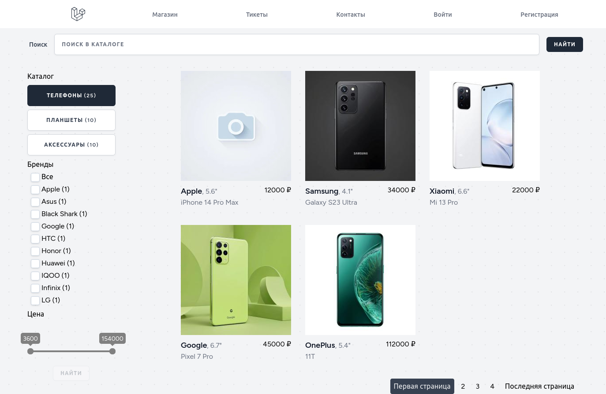

# МассПроект, тестовое задание (Артур М.)

**Стёк:** Laravel, InertiaJS + Vue3, ELK.

Скачать GIT-репозиторий. Создать новый *.env* файл (из *.env.example*).

Выполнить следующие команды:

    composer install
    php artisan vendor:publish (ресурсы всех вендров: All providers and tags)
    php artisan sail:publish
    ./sail build --no-cache
    ./sail up
    
    *(в новом окне терминала)*
    ./sail artisan migrate
    ./sail artisan db:seed
    ./sail artisan storage:link
    ./sail npm install
    ./sail npm run dev

Устновить актуальное значение MAIL_FROM_ADDRESS.

Перейти на страницу [http://0.0.0.0/](http://0.0.0.0/). Создать заявку, заполнив форму.

Перейти на страницу авторизации [http://0.0.0.0/login](http://0.0.0.0/login). Данные для авторизации, логин и пароль: *test@example.com*, *123*. На странице список заявок  [Dashboard](http://0.0.0.0/dashboard) и обработать, поменять сортировку списка. Осуществляется доставка почты (при правильных настройках).

##Тестовый магазин продукции

При установке конфигурация **Logstash** обновляет индекс **ElasticSearch (ES)** из БД Ларавел. Магазин состоит из секции поиска продукта, меню фильтра, каталога продукции с пейджингом.
Блок *Поиска* осуществляет поиск продкции в индексах ES, с помощью составного запроса.
Компонент Vue *Меню фильтра* состоит из кнопок каталога, в проекте 3 раздела (кол-во продукции в каждом разделе отображаются агрегациями ES). *Бренды* и *Цена* фильтруют продукты с соответствии с критериями. Слайдер цены отображаются внешним Vue-компонентом.

По вопросам прошу писать на [Телеграм](https://t.me/artip7)